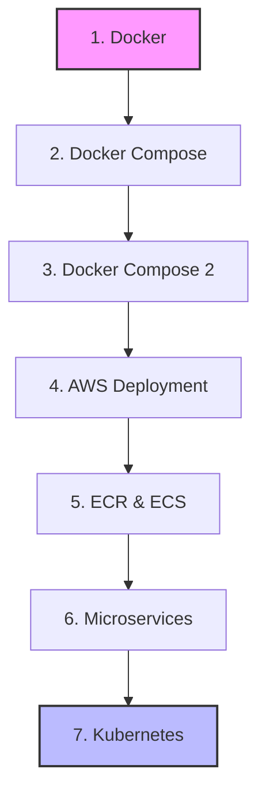

# 🚀 Full-Stack DevOps & Cloud Learning Journey

Welcome to the comprehensive learning sequence guide! This repository is designed to take you from a complete beginner in containerization to a cloud-ready developer. 

## 🏁 Getting Started

If you are new here, **start with the `docker` folder** and follow the numbered progression below. Each stage builds upon the previous one, so don't skip ahead!

### 🗺️ Learning Path Visualization

---

## 📂 1. [docker](file:///c:/Users/yashk/Desktop/cohort/docker)
**The Foundation of Isolation**

- **Core Concepts**: Images vs. Containers, Dockerfiles, Layers, and Port Mapping.
- **Prerequisites**: Basic knowledge of Node.js and terminal commands.
- **Learning Objectives**:
  - Build your first Docker image.
  - Run a containerized Node.js server.
  - Understand how to map host ports to container ports.
- **Practical Projects**: A simple Express.js server containerized using a `Dockerfile`.
- **Next Step**: Move to `docker-compose` to manage multiple containers easily.

## 📂 2. [docker-compose](file:///c:/Users/yashk/Desktop/cohort/docker-compose)
**Orchestrating Multiple Services**

- **Core Concepts**: Declarative configuration with YAML, Service definitions, and Volumes for hot-reloading.
- **Prerequisites**: Completion of the `docker` stage.
- **Learning Objectives**:
  - Replace long `docker run` commands with `docker-compose.yml`.
  - Use Volumes to sync local code changes instantly (Hot Reloading).
  - Manage container lifecycles with `up` and `down`.
- **Practical Projects**: A single-service setup optimized for developer experience.
- **Next Step**: Head over to `docker-compose2` to see how a full-stack app works together.

## 📂 3. [docker-compose2](file:///c:/Users/yashk/Desktop/cohort/docker-compose2)
**Full-Stack Containerization**

- **Core Concepts**: Multi-container networking, Vite Proxying, and Shared Volumes.
- **Prerequisites**: Familiarity with React and basic Express.
- **Learning Objectives**:
  - Connect a React frontend to an Express backend inside a Docker network.
  - Solve CORS issues using Vite's proxy settings.
  - Implement the "Double Volume" strategy for `node_modules`.
- **Practical Projects**: A complete React + Node.js application running in harmony.
- **Next Step**: Now that you can run it locally, let's look at `aws` for cloud preparation.

## 📂 4. [aws](file:///c:/Users/yashk/Desktop/cohort/aws)
**Preparing for the Cloud**

- **Core Concepts**: Production vs. Development architectures, Multi-stage builds.
- **Prerequisites**: Completion of all Docker stages.
- **Learning Objectives**:
  - Optimize images for production using multi-stage builds.
  - Serve a React frontend as static files through an Express server.
  - Understand environmental parity between local and cloud.
- **Practical Projects**: A cloud-ready monolithic container build.
- **Next Step**: Proceed to `ecr_ecs` to learn about AWS container registries and services.

## 📂 5. [ecr_ecs](file:///c:/Users/yashk/Desktop/cohort/ecr_ecs)
**Scaling in the Cloud**

- **Core Concepts**: Elastic Container Registry (ECR) and Elastic Container Service (ECS).
- **Prerequisites**: An AWS account and AWS CLI installed.
- **Learning Objectives**:
  - Push Docker images to a private cloud registry (ECR).
  - Deploy and manage containers using ECS Fargate.
  - Understand stateless application design for cloud scaling.
- **Practical Projects**: Deployment blueprints for AWS infrastructure.
- **Next Step**: Explore the architectural theory in `microservice`.

## 📂 6. [microservice](file:///c:/Users/yashk/Desktop/cohort/microservice)
**Architecture at Scale**

- **Core Concepts**: Monolith vs. Microservices, Service discovery, and Scalability.
- **Prerequisites**: Understanding of basic web architecture.
- **Learning Objectives**:
  - Identify when to choose microservices over a monolith.
  - Understand the challenges of distributed systems (networking, latency).
- **Practical Projects**: Theoretical deep-dive and comparison guides.
- **Next Step**: Final stop—`kuber` for container orchestration.

## 📂 7. [kuber](file:///c:/Users/yashk/Desktop/cohort/kuber)
**The Orchestration Giant**

- **Core Concepts**: Pods, Deployments, Services, and Kubernetes Architecture.
- **Prerequisites**: Strong grasp of Docker and container networking.
- **Learning Objectives**:
  - Understand how Kubernetes manages container clusters.
  - Learn the basics of declarative infrastructure with K8s manifests.
- **Practical Projects**: Basic server setup ready for Kubernetes deployment.

---

## 🛠️ Tool Setup Guide

To get the most out of this cohort, ensure you have these tools installed:

1. **Docker Desktop**: The core engine for running containers. [Download here](https://www.docker.com/products/docker-desktop/).
2. **Node.js (v20+)**: Required for running the applications locally before containerizing. [Download here](https://nodejs.org/).
3. **VS Code**: Recommended editor with the "Docker" extension.
4. **AWS CLI**: Needed for the `ecr_ecs` stage. [Install guide](https://docs.aws.amazon.com/cli/latest/userguide/getting-started-install.html).

---

## 💡 Troubleshooting Tips for Beginners

| Issue | Solution |
| :--- | :--- |
| **"Port already in use"** | Another app is using the port (e.g., 3000). Stop the other app or change the host port in `docker-compose.yml`. |
| **Changes not reflecting** | Ensure you have volumes correctly mapped and that your app (like `nodemon`) is watching for changes. |
| **"Cannot connect to Docker"** | Make sure Docker Desktop is running. On Windows, ensure WSL2 is enabled. |
| **CORS Errors** | Double-check your `vite.config.js` proxy settings. Ensure the target matches your backend service name. |
| **Slow Builds** | Check your `.dockerignore` file. Make sure you aren't copying `node_modules` from your host to the image. |

---

*Happy Learning! Remember: Every expert was once a beginner. Take it one container at a time.* 🐳
