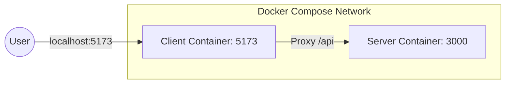
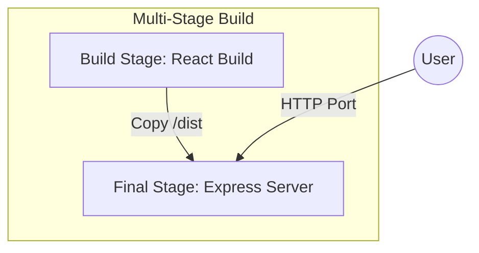

# 🚀 Full-Stack Dockerization & Deployment Journey

This repository is a technical deep-dive into the architectural patterns of modern full-stack applications, focusing on **containerization**, **development-to-production workflows**, and **cloud-ready deployment strategies**.

Built during a learning cohort, this project serves as a blueprint for bridging the gap between "it works on my machine" and "it's ready for AWS."

---

## 🎯 Learning Goals
- [x] **Containerization**: Mastering Docker for both local development and production-grade builds.
- [x] **Microservices Networking**: Understanding how frontend and backend communicate across isolated environments.
- [x] **Multi-Stage Builds**: Optimizing Docker images by separating build-time dependencies from runtime artifacts.
- [x] **Vite Proxying**: Solving Cross-Origin Resource Sharing (CORS) issues without bloating backend logic.
- [x] **Production Orchestration**: Learning how to serve a Single Page Application (SPA) through an Express backend.

---

## 🛠 Tech Stack

| Layer | Technology | Why it's here |
| :--- | :--- | :--- |
| **Frontend** | [React 19](https://react.dev/) | Utilizing the latest React features for efficient UI rendering. |
| **Build Tool** | [Vite](https://vite.dev/) | Lightning-fast HMR (Hot Module Replacement) and optimized bundling. |
| **Backend** | [Express 5](https://expressjs.com/) | Lightweight, modular server-side framework for API and static serving. |
| **Networking** | [Axios](https://axios-http.com/) | Promise-based HTTP client for seamless API communication. |
| **DevOps** | [Docker](https://www.docker.com/) | Ensuring environmental parity across dev, staging, and production. |

---

## 🏗 System Architecture

The project implements two distinct architectural flows depending on the environment.

### 1. Development Architecture (Docker Compose)
In development, we prioritize speed and DX (Developer Experience).
- **Two Containers**: One for the React dev server, one for the Express API.
- **Hot Reloading**: Achieved via [Docker Volumes](https://docs.docker.com/storage/volumes/), mapping host source code to the container.
- **Proxying**: Vite intercepts `/api` calls and forwards them to the server container.



### 2. Production Architecture (Multi-Stage Build)
In production, we prioritize efficiency and security.
- **Single Container**: The Express server serves both the API and the pre-built React static files.
- **Artifact Isolation**: The React build environment (Node, npm, dev-deps) is discarded after the build is finished.



---

## 📂 Folder Structure Explained

```text
.
├── client/                 # React Frontend (Vite)
│   ├── src/                # Component logic & styles
│   ├── dockerfile          # Dev-specific container config
│   └── vite.config.js      # Proxy & networking configuration
├── server/                 # Express Backend
│   ├── public/             # Static assets (populated during build)
│   ├── server.js           # Entry point (API + Static Server)
│   └── dockerfile          # Dev-specific container config
├── docker-compose.yml      # Orchestration for local development
└── dockerfile              # ROOT: Production Multi-stage Build config
```

---

## 🧠 Engineering Insights & Discoveries

### 1. The "Double Volume" Strategy
In [docker-compose.yml](file:///c:/Users/yashk/Desktop/cohort/aws/docker-compose.yml), we use:
```yaml
volumes:
  - ./client:/app
```
This allows us to edit code on our host machine and see changes instantly inside the container. It solves the "rebuild every time" problem that makes Docker slow for development.

### 2. Networking & `0.0.0.0`
In [vite.config.js](file:///c:/Users/yashk/Desktop/cohort/aws/client/vite.config.js), the host is set to `0.0.0.0`.
**Why?** By default, Vite listens on `localhost` (127.0.0.1). Inside a container, `localhost` refers to the container itself, making the service unreachable from the host machine. Binding to `0.0.0.0` tells Vite to listen on all available network interfaces.

### 3. The SPA "Catch-All" Route
In [server.js](file:///c:/Users/yashk/Desktop/cohort/aws/server/server.js), we use:
```javascript
app.use("*name", (req, res) => {
    res.sendFile("public/index.html", { root: __dirname })
})
```
This is critical for Single Page Applications. If a user refreshes the page on `/dashboard`, Express would normally return a 404. This catch-all route ensures the `index.html` is always served, allowing React Router to handle the URL client-side.

### 4. Multi-Stage Build Optimization
The root [dockerfile](file:///c:/Users/yashk/Desktop/cohort/aws/dockerfile) is the most "Senior" part of the repo. It uses:
1. `AS clent_builder`: A temporary workspace to compile React code.
2. `COPY --from=clent_builder`: Extracts only the production-ready `/dist` folder.
**Result**: A final image that doesn't contain `node_modules` from the frontend or the Vite build tool, significantly reducing the attack surface and image size.

---

## 🚀 Key Commands

### Development (Hot-Reloading)
```bash
docker-compose up --build
```

### Production Build (Single Image)
```bash
docker build -t fullstack-app .
docker run -p 3000:3000 fullstack-app
```

---

## 🚧 Challenges & Breakthroughs

- **CORS Headaches**: Initially, the frontend couldn't talk to the backend because they were on different ports.
  - *Breakthrough*: Instead of enabling `cors()` in Express (which is less secure), I used Vite's `proxy` feature to make the frontend *think* it's talking to the same origin.
- **Docker Networking**: Understanding that containers talk to each other using service names (e.g., `http://server:3000`) rather than `localhost`.

---

## 📝 Personal Notes
This project is named `aws` because the ultimate goal is to push the final Docker image to **Amazon ECR** and run it on **Amazon ECS (Fargate)**. The architecture is designed to be stateless and scalable, making it perfect for cloud-native deployment.

---

## 📚 Glossary
- **HMR**: Hot Module Replacement. Replacing modules in a running application without a full reload.
- **Multi-Stage Build**: A Docker technique to keep image sizes small by using multiple `FROM` statements.
- **Proxy**: A server that acts as an intermediary for requests from clients seeking resources from other servers.

---
*Created with ❤️ as part of the Full-Stack Engineering Cohort.*
