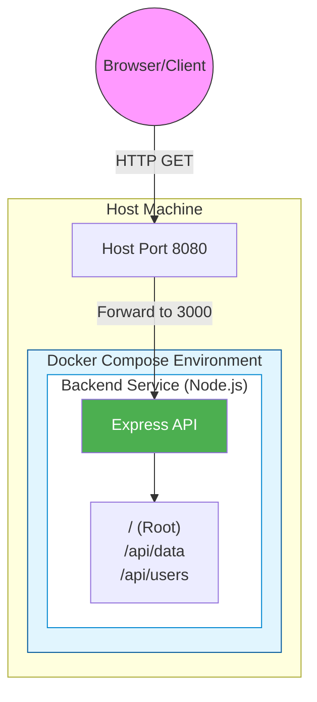
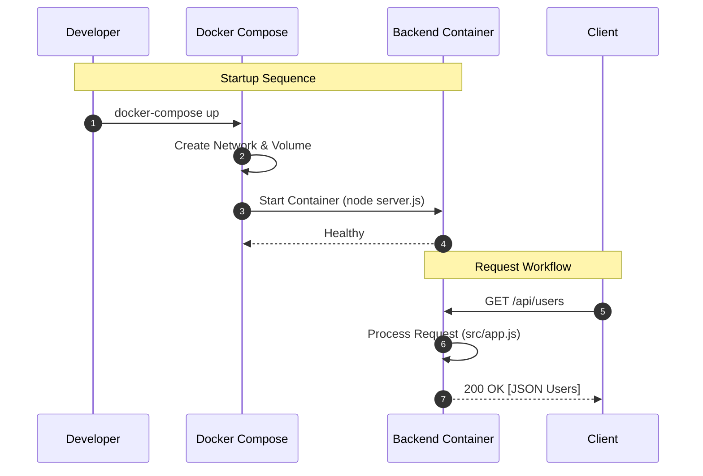

# 🐙 Docker Compose: Orchestrating the Future

This repository is a comprehensive learning journal and technical documentation of my journey into **Docker Compose**. It tracks the transition from managing individual containers to orchestrating complex, multi-service environments with ease.

---

## 📈 Learning Progress

### 📅 Chronological Timeline

| Date | Milestone | Key Focus |
| :--- | :--- | :--- |
| **2026-05-11** | The Shift | Moving from `docker run` to `docker-compose.yml`. |
| **2026-05-12** | YAML Mastery | Defining services, build contexts, and environment variables. |
| **2026-05-13** | Developer Flow | Implementing volumes for hot-reloading and multi-service networking. |

### 💡 Conceptual Breakthroughs
- **Declarative vs. Imperative**: I realized that `docker run` is like telling a waiter every single ingredient you want in a dish (Imperative), while Docker Compose is like handing them a menu item name (Declarative). You define the *desired state*, and Compose makes it happen.
- **The Power of `up`**: Seeing multiple services spin up with a single command was the "click" moment. It's not just about running containers; it's about defining an entire *environment*.

### 🚧 Challenges & Solutions
| Challenge | Solution |
| :--- | :--- |
| **Port Conflicts** | I initially tried to map `3000:3000` on multiple services. I learned to use unique host ports (e.g., `8080:3000`) while keeping internal ports consistent. |
| **Code Syncing** | Changes in my local `server.js` weren't reflecting in the container. I discovered **Bind Mounts** (Volumes) and integrated `nodemon` to watch for changes. |
| **Container Startup Order** | Sometimes the backend would crash because it couldn't find a (future) database. I mastered the `depends_on` property to ensure proper boot sequence. |

### 🧘 Reflective Commentary
Achieving the "One Command Setup" (`docker-compose up`) felt like reaching a new level of developer maturity. No more "Check README for setup steps"—the setup is the code itself.

---

## ⚙️ Technical Details

### ⌨️ Command History & Syntax
The primary interface for managing this environment:

```bash
# Start all services in detached mode
docker-compose up -d

# Build or rebuild services (useful after changing Dockerfile)
docker-compose up --build

# Stop and remove containers, networks, and images defined in the file
docker-compose down

# View real-time logs for a specific service
docker-compose logs -f backend

# Execute a command inside a running service container
docker-compose exec backend sh
```

### 🧩 Key Docker Compose Concepts
- **Services**: Each container in your app is a "service." They are the building blocks of your environment.
- **Volumes**: Persistent data storage. In this project, we use a bind mount (`./server:/app`) to sync local code with the container for instant updates.
- **Networks**: Docker Compose creates a default network for all services to communicate using their service names (e.g., `http://backend:3000`).

### 📚 Mastered Glossary
- **YAML**: The human-readable data serialization language used for Compose files.
- **Orchestration**: The automated configuration, management, and coordination of computer systems and software.
- **Hot Reloading**: The ability to update code in a running application without a full restart, enabled here via volumes and `nodemon`.
- **Bridge Network**: The default network driver that allows containers on the same host to communicate.

### 🔗 Referenced Resources
- [Docker Compose Overview](https://docs.docker.com/compose/): The foundational source for syntax and best practices.
- [Nodemon in Docker](https://github.com/remy/nodemon): Learned how to use the `-L` (legacy watch) flag for reliable volume syncing on different OS.
- [YAML Lint](https://yamllint.com/): Essential for debugging indentation errors in `.yml` files.

### 🔄 Before & After: Progress Snippets
**Before (The "Long Way"):**
```bash
docker build -t my-app ./server
docker run -d -p 8080:3000 --name my-app-running my-app
```

**After (The "Compose Way"):**
```yaml
# One file to rule them all
services:
  backend:
    build: ./server
    ports:
      - 8080:3000
    volumes:
      - ./server:/app
```

---

## 🏛️ Advanced Architecture Visualizations

### 1. System Architecture Diagram
Illustrating the high-level components and their interactions.



### 2. Startup & Request Sequence
How the system initializes and handles a typical request.



### 3. Deployment & Infrastructure Diagram
Detailed view of volume mappings, networking, and environment management.

```mermaid
deploymentDiagram
    %% This is a conceptual deployment diagram using Mermaid's node syntax
    node "Developer Machine" {
        folder "./server" as SourceCode
        
        node "Docker Engine" {
            network "default_bridge" as Net
            
            node "Backend Container" {
                component "Express App" as App
                port "3000" as P3000
                folder "/app" as ContainerVol
            }
        }
    }
    
    %% Relationships
    SourceCode -.->| "Volume Mount" | ContainerVol : "Live Sync"
    P3000 -- Net
    
    note right of SourceCode : Local edits trigger nodemon
    note right of ContainerVol : WORKDIR /app
```

---
*Created with ❤️ by a Docker Compose explorer.*
