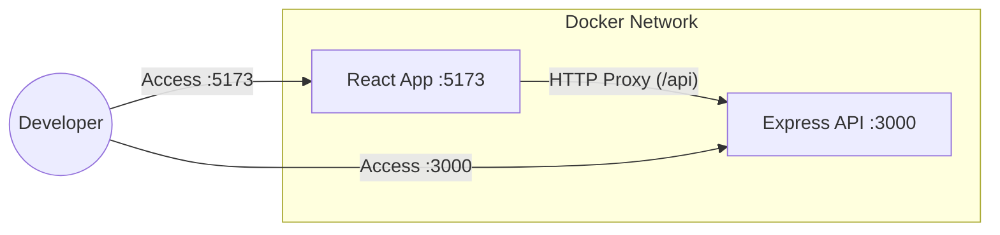

# 🐳 Full-Stack Containerization: A Learning Journey

Welcome to the **Docker-Compose-2** project. This repository isn't just a simple "Hello World" app; it's a deep dive into modern DevOps patterns, specifically focusing on how to architect, containerize, and orchestrate a full-stack application for a seamless development experience.

---

## 🎯 Project Overview
This project consists of a **React (Vite)** frontend and an **Express.js** backend, fully containerized using Docker. The goal was to solve the "it works on my machine" problem while maintaining a high-velocity development workflow (Hot Module Replacement, shared networking, and volume management).

### Why this exists?
To explore the intersection of full-stack development and infrastructure. Specifically:
- How to manage microservices in a local environment.
- How to handle cross-container communication.
- How to optimize Docker images for development vs. production.

---

## 🏗 System Architecture

The following diagram illustrates how the components interact. Note the role of the **Vite Proxy** as the bridge between the client and server.



---

## 🛠 Tech Stack

| Layer | Technology | Purpose |
| :--- | :--- | :--- |
| **Frontend** | [React 19](https://react.dev/) | UI Library |
| **Bundler** | [Vite 8](https://vitejs.dev/) | Development Server & Build Tool |
| **Backend** | [Express 5](https://expressjs.com/) | REST API |
| **Containerization** | [Docker](https://www.docker.com/) | Process Isolation |
| **Orchestration** | [Docker Compose](https://docs.docker.com/compose/) | Multi-container Management |

---

## 📁 Folder Structure Explained

```text
.
├── client/                # React application
│   ├── src/               # UI components and logic
│   ├── dockerfile         # Client-specific container instructions
│   └── vite.config.js     # Proxy and dev-server configuration
├── server/                # Node.js Express API
│   ├── server.js          # API endpoints and server logic
│   └── dockerfile         # Server-specific container instructions
├── docker-compose.yml     # The "Orchestrator" - binds everything together
└── README.md              # You are here!
```

---

## 🧠 Core Concepts & Engineering Insights

### 1. Docker Networking & DNS
Inside a `docker-compose` environment, containers can talk to each other using their service names.
- **Mental Model**: Think of the service name `server` as a local domain name.
- **Implementation**: In [vite.config.js](file:///c:/Users/yashk/Desktop/cohort/docker-compose2/client/vite.config.js), we proxy `/api` to `http://server:3000`. Docker handles the IP resolution automatically.

### 2. The "Double Volume" Strategy
We use a sophisticated volume mounting strategy in [docker-compose.yml](file:///c:/Users/yashk/Desktop/cohort/docker-compose2/docker-compose.yml):
```yaml
volumes:
  - ./client:/app
  - client_node_modules:/app/node_modules
```
- **The Problem**: Mounting the host directory (`./client`) into the container overwrites the container's `/app/node_modules` with the host's version (which might be empty or incompatible).
- **The Solution**: By creating a **Named Volume** (`client_node_modules`) for the `node_modules` directory, we tell Docker: "Use the host files for everything *except* node_modules. For that, use this dedicated container-side storage."
- **Result**: We get Hot Module Replacement (HMR) from the host files AND correct dependencies inside the container.

### 3. Alpine Linux: Security & Efficiency
Both [client/dockerfile](file:///c:/Users/yashk/Desktop/cohort/docker-compose2/client/dockerfile) and [server/dockerfile](file:///c:/Users/yashk/Desktop/cohort/docker-compose2/server/dockerfile) use `node:20-alpine`.
- **Why?**: Alpine is a minimal Linux distribution (~5MB).
- **Benefit**: Smaller attack surface (less pre-installed software) and faster build/pull times.

---

## 🚀 Execution Flow

1.  **Compose Up**: `docker-compose up` triggers the build.
2.  **Dependency Install**: Containers run `npm install` during the build phase.
3.  **Service Discovery**: The `client` container starts its Vite server; the `server` container starts Express via `nodemon`.
4.  **Request Flow**:
    - Browser requests `localhost:5173`.
    - React component [App.jsx](file:///c:/Users/yashk/Desktop/cohort/docker-compose2/client/src/App.jsx) triggers `axios.get('/api/users')`.
    - Vite Proxy intercepts `/api` and forwards it to `http://server:3000`.
    - Express [server.js](file:///c:/Users/yashk/Desktop/cohort/docker-compose2/server/server.js) returns the JSON user list.

---

## ⚡ Key Commands Used

| Action | Command |
| :--- | :--- |
| **Start Environment** | `docker-compose up` |
| **Rebuild & Start** | `docker-compose up --build` |
| **Stop & Remove** | `docker-compose down` |
| **Clean Volumes** | `docker-compose down -v` |

---

## 🛠 Challenges & Breakthroughs

### ❌ The CORS Nightmare
Initially, the frontend couldn't talk to the backend because they were on different ports (`5173` vs `3000`).
- **Breakthrough**: Instead of enabling CORS on the server (which is a security trade-off), I used the **Vite Proxy**. This makes the browser think all requests are going to the same origin (`5173`), while Vite handles the heavy lifting in the background.

### ❌ Node Modules Syncing
Host `node_modules` were conflicting with container `node_modules` (especially on different OS architectures).
- **Breakthrough**: Implemented the "Anonymous/Named Volume" override in `docker-compose.yml`. This isolated the container's dependencies while still allowing code sync.

---

## 📝 Personal Notes & Future Improvements
- **Security**: Move the mock data in `server.js` to a real PostgreSQL or MongoDB container.
- **Production**: Create a multi-stage Dockerfile to serve the React app via Nginx.
- **Health Checks**: Add `healthcheck` to the server service to ensure the client doesn't start until the API is ready.

---

## 📚 Resources
- [Docker Compose Documentation](https://docs.docker.com/compose/)
- [Vite Proxy Configuration](https://vitejs.dev/config/server-options.html#server-proxy)
- [Node.js Alpine Images](https://hub.docker.com/_/node)

---
*Created with ❤️ by an engineer exploring the world of containers.*
