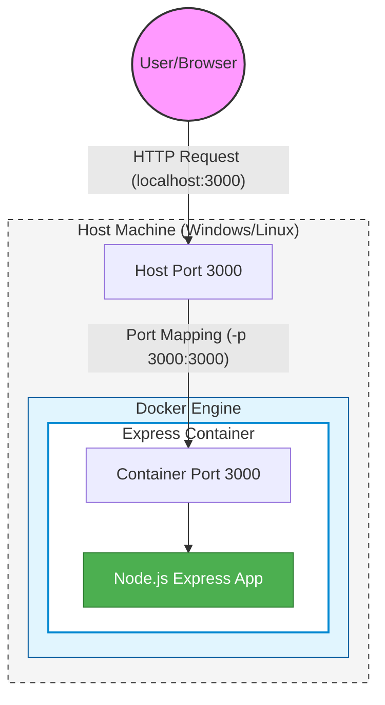
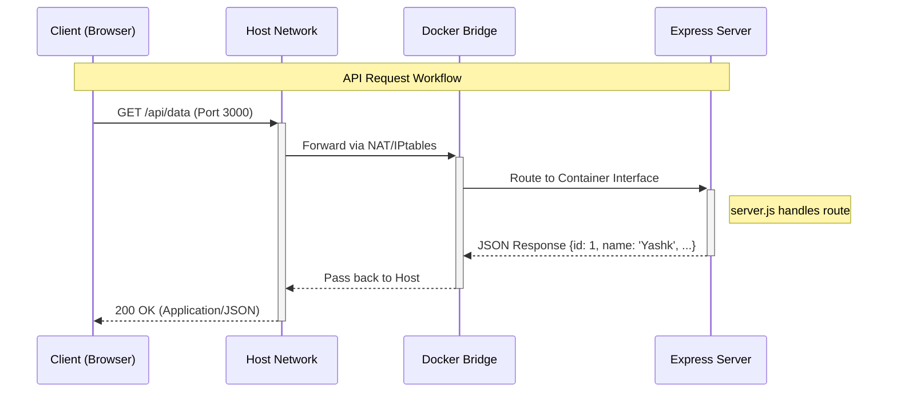
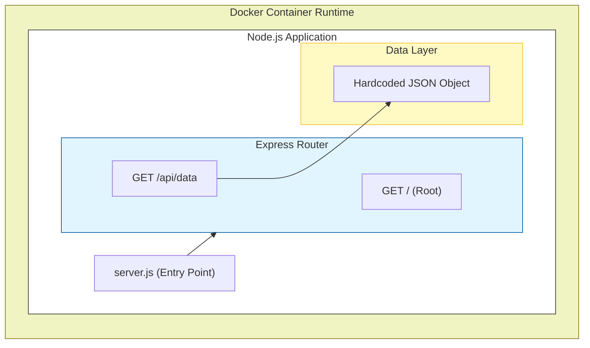

# 🐳 My Docker Learning Journey: From Local Host to Containerized World

This repository serves as a comprehensive journal of my journey into the world of Docker. It documents every step, concept, and challenge I encountered while containerizing a Node.js Express server.

---

## 📅 Learning Timeline

| Date | Milestone | Key Concepts Covered |
| :--- | :--- | :--- |
| **2026-05-10** | The Beginning | Node.js environment setup, Express.js basics. |
| **2026-05-11** | First Contact | Installing Docker, understanding Images vs. Containers. |
| **2026-05-12** | Crafting the Blueprint | Writing the first `Dockerfile`, building images. |
| **2026-05-13** | Portals & Bridges | Port mapping, running containers, and debugging. |

---

## 🚀 Step-by-Step Execution Log

### Phase 1: Local Development
First, I built a standard Node.js server to have something to containerize.
```bash
# Initialize the project
npm init -y

# Install dependencies
npm install express

# Start the server locally
node server.js
```

### Phase 2: Dockerization
Once the server was running locally, I moved it into a container.
```bash
# Build the Docker image (tagged as 'my-express-server')
docker build -t my-express-server .

# Run the container with port mapping (Host:3000 -> Container:3000)
docker run -p 3000:3000 my-express-server

# List running containers
docker ps

# Stop the container
docker stop <container_id>
```

---

## 🧠 Key Concepts Explained

### 1. Images vs. Containers
Think of an **Image** as a blueprint or a recipe (like a class in OOP). It's read-only and contains everything needed to run an app.
A **Container** is the actual instance of that blueprint (like an object). It's the "running" version of the image.

### 2. The Dockerfile
The `Dockerfile` is a text document containing all the commands a user could call on the command line to assemble an image.
- `FROM`: Sets the base image (e.g., `node:20-alpine`).
- `COPY`: Moves files from your host machine into the image.
- `RUN`: Executes commands during the build process (like `npm install`).
- `CMD`: The command that runs when the container starts.

### 3. Layer Caching
Docker builds images in layers. If you change a file, Docker only rebuilds the layers from that point onwards. This is why we copy `package.json` before `server.js`—to avoid re-running `npm install` if only our code changed!

---

## 🏗️ Architecture Visualization

To better understand how the system components interact, here are detailed visualizations using Mermaid.

### 1. Deployment & Networking Structure
This diagram illustrates the relationship between the Host machine and the Docker container, highlighting the port mapping mechanism.



### 2. Request-Response Lifecycle
A sequence diagram showing how a request travels from the client through the Docker layers to our Express routes.



### 3. Internal System Architecture
This diagram breaks down the internal structure of the Node.js application running inside the container.



---

## 🛠️ Challenges & Breakthroughs

| Challenge | The "Aha!" Solution |
| :--- | :--- |
| **Server unreachable** | Realized I forgot `-p 3000:3000`. The container's port 3000 was isolated until I mapped it to the host. |
| **Slow Builds** | Discovered Layer Caching. Moving `COPY package.json` above `COPY .` saved minutes of install time. |
| **Huge Image Size** | Switched from `node:latest` to `node:20-alpine`. Reduced image size from ~1GB to ~150MB! |

---

## 📝 Before vs. After: Progress Snippets

**Before (Local Only):**
The app was tied to my specific machine's Node version and installed packages.
```javascript
// server.js
// Works on my machine with Node v20.10.0
import express from 'express';
// ...
```

**After (Containerized):**
The app is now portable. It carries its own environment.
```dockerfile
# dockerfile
FROM node:20-alpine
COPY ./package.json .
RUN npm install
COPY ./server.js .
CMD ["node", "server.js"]
```

---

## 📖 Glossary of Mastered Terms

- **Daemon**: The background service that manages Docker objects.
- **Registry**: A storage and distribution system for Docker images (e.g., Docker Hub).
- **Volume**: A mechanism for persisting data generated by and used by Docker containers.
- **Alpine**: A minimal Linux distribution often used as a base image to keep sizes small.
- **Port Mapping**: Connecting a port on the host machine to a port inside the container.

---

## 💡 Personal Insights

The biggest "click" moment for me was realizing that **Docker isn't a Virtual Machine**. It's just a process with its own namespace. This explains why it starts so fast compared to a VM. Seeing "Hello World" in my browser from a container running on a "blank" Linux base image felt like magic—it proved that "it works on my machine" is finally a solved problem.

---

## 🔗 Resources Used

- [Official Docker Documentation](https://docs.docker.com/)
- [Node.js Docker Best Practices](https://github.com/nodejs/docker-node/blob/main/docs/BestPractices.md)
- [Trae IDE Tutorials](https://www.trae.ai/)
- [Hussein Nasser's Containerization Videos](https://www.youtube.com/c/HusseinNasser)

---
*Created with ❤️ during my Docker journey.*
