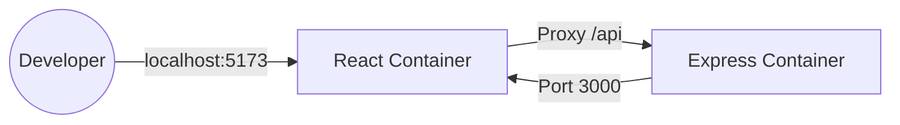
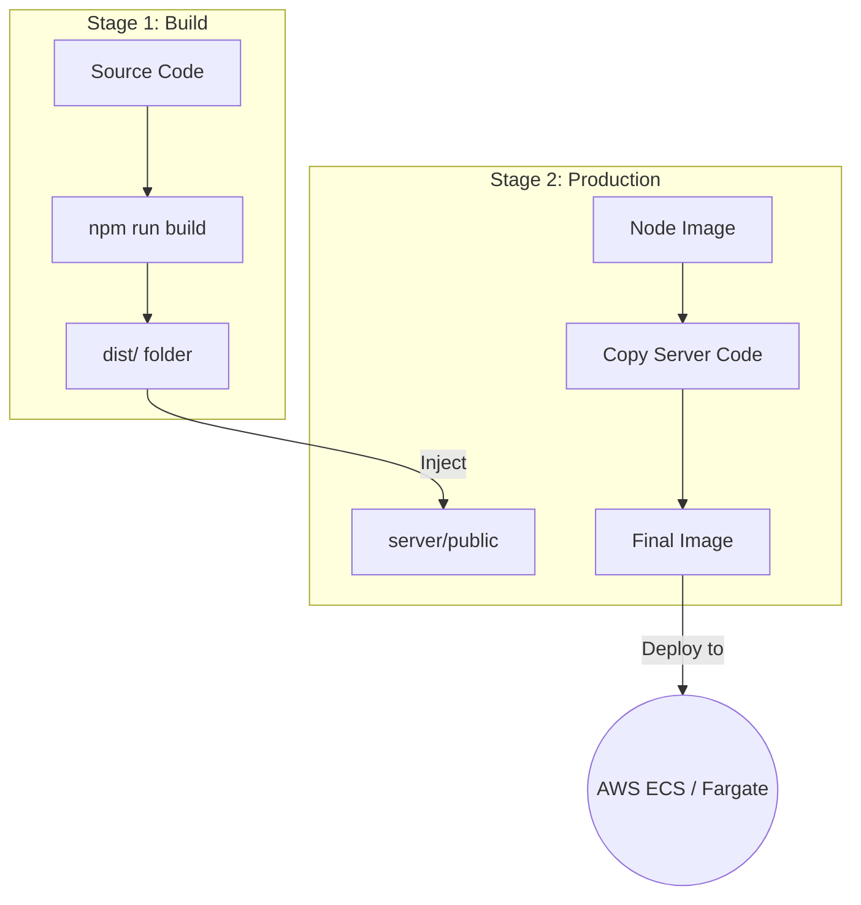

# 🚀 Architectural Blueprint: From Local Docker to AWS ECR/ECS

> **Process Name:** *The Containerized Journey — Deep Repository Analysis & Educational Documentation*

This repository is a high-fidelity technical journal of a developer transitioning from local "works-on-my-machine" development to a production-ready, containerized architecture suitable for AWS ECR (Elastic Container Registry) and ECS (Elastic Container Service).

## 🎯 Project Overview
This project serves as a foundational boilerplate for a full-stack application (React + Node.js) designed with a **"Container-First"** mindset. It isn't just a "Hello World" app; it's an exploration of how networking, build optimization, and deployment pipelines intersect in a modern DevOps workflow.

### Why this exists?
1. **Solve CORS during development** without messy headers.
2. **Master Docker Orchestration** using Docker Compose for local workflows.
3. **Optimize Production Images** using Multi-stage builds to minimize cloud costs and security surface area.
4. **Prepare for AWS ECS** by ensuring the application is stateless and correctly bundled.

---

## 🛠 Tech Stack

| Layer | Technology | Role |
| :--- | :--- | :--- |
| **Frontend** | [React 19](https://react.dev/) + [Vite](https://vitejs.dev/) | Ultra-fast development with HMR (Hot Module Replacement). |
| **Backend** | [Node.js](https://nodejs.org/) + [Express](https://expressjs.com/) | Lightweight API handling user data. |
| **Communication** | [Axios](https://axios-http.com/) | Promise-based HTTP client for API requests. |
| **Containerization** | [Docker](https://www.docker.com/) | Consistent environments across dev, staging, and prod. |
| **Orchestration** | [Docker Compose](https://docs.docker.com/compose/) | Managing multi-container local environments. |

---

## 🏗 System Architecture

The project explores two distinct architectural patterns depending on the environment:

### 1. Development Architecture (Distributed)
In development, we prioritize speed. The client and server run as separate containers, allowing for **Vite's HMR** and **Nodemon's auto-restart** to work seamlessly via Docker volumes.



### 2. Production Architecture (Monolithic Container)
When deploying to AWS ECS, we optimize for simplicity and performance. The [root dockerfile](file:///c:/Users/yashk/Desktop/cohort/ecr_ecs/dockerfile) uses a **Multi-Stage Build** to compile the React frontend and inject it into the Express backend's static folder.



---

## 🧠 Key Concepts & Engineering Insights

### 1. The Vite Proxy Magic 🪄
**Problem:** In development, the React app runs on port `5173` and the API on `3000`. Direct requests trigger **CORS (Cross-Origin Resource Sharing)** errors.
**Solution:** In [vite.config.js](file:///c:/Users/yashk/Desktop/cohort/ecr_ecs/client/vite.config.js), we configured a proxy:
```javascript
proxy: {
  "/api": {
    target: "http://localhost:3000",
    changeOrigin: true,
  }
}
```
**Mental Model:** The browser thinks it's talking to the same origin (`5173`). Vite acts as a "middleman" that forwards the request to the backend. This mimics production behavior where both often sit behind the same Load Balancer.

### 2. Multi-Stage Docker Builds 🏗️
The root [dockerfile](file:///c:/Users/yashk/Desktop/cohort/ecr_ecs/dockerfile) is the "Crown Jewel" of this repo. 
- **Efficiency:** It uses a temporary builder image (`client_builder2`) to compile React. Once the `dist` folder is created, the builder image is discarded.
- **Security:** The final production image only contains the compiled JS/HTML and the Node server—no source code, no `devDependencies`, and no unnecessary build tools.

### 3. Container Networking & Volumes 🌐
In [docker-compose.yml](file:///c:/Users/yashk/Desktop/cohort/ecr_ecs/docker-compose.yml), we use:
- **Volumes:** `./client:/app` allows you to change code on your Windows machine and see it update instantly inside the Linux container.
- **Port Mapping:** `5173:5173` bridges your host machine's browser to the container's internal network.

---

## 📂 Folder Structure Explained

- `client/`: The React frontend.
    - `src/App.jsx`: Main logic for fetching and displaying users.
    - `dockerfile`: Optimized for development HMR.
- `server/`: The Express backend.
    - `server.js`: Simple API exposing `/api/users`.
    - `dockerfile`: Standard Node.js environment.
- `docker-compose.yml`: The orchestrator that glues the services together for local dev.
- `dockerfile` (root): The **Production Build Script** that prepares the app for AWS.

---

## 🚀 Execution Flow

### Local Development
1. **Command:** `docker-compose up --build`
2. **What happens:** 
    - Docker builds two images.
    - Containers start and share the host network.
    - [App.jsx](file:///c:/Users/yashk/Desktop/cohort/ecr_ecs/client/src/App.jsx) makes a request to `/api/users`.
    - Vite proxies this to the `server` container.
    - You see "Yashk", "Rashk", and "Shashk" rendered on screen.

### AWS Deployment Prep
1. **Command:** `docker build -t ecr-ecs-app .`
2. **What happens:** 
    - The multi-stage build runs.
    - The final image is created, ready to be tagged and pushed to **AWS ECR**.
    - The image is then pulled by **AWS ECS** to run as a Task.

---

## 🛠️ Mistakes & Debugging Journey
- **The Localhost Trap:** Initially, using `localhost:3000` in the proxy config inside a container can fail because `localhost` refers to the container itself. 
- **Fix:** In Docker Compose, services should ideally refer to each other by name (e.g., `http://server:3000`).
- **Static File Serving:** The production build copies files to `server/public`, but the server needs `app.use(express.static('public'))` to actually serve them! (A key discovery during the monolithic bundling phase).

---

## 📝 Personal Notes & Future Improvements
- [ ] **Add Database:** Integrate a MongoDB or PostgreSQL container.
- [ ] **Environment Variables:** Move the API URL to an `.env` file for better 12-factor app compliance.
- [ ] **CI/CD:** Add a GitHub Action to automatically push the root Dockerfile to ECR on every push to `main`.

---
*This documentation was generated as part of a deep architectural audit. Keep building!* 🚀
