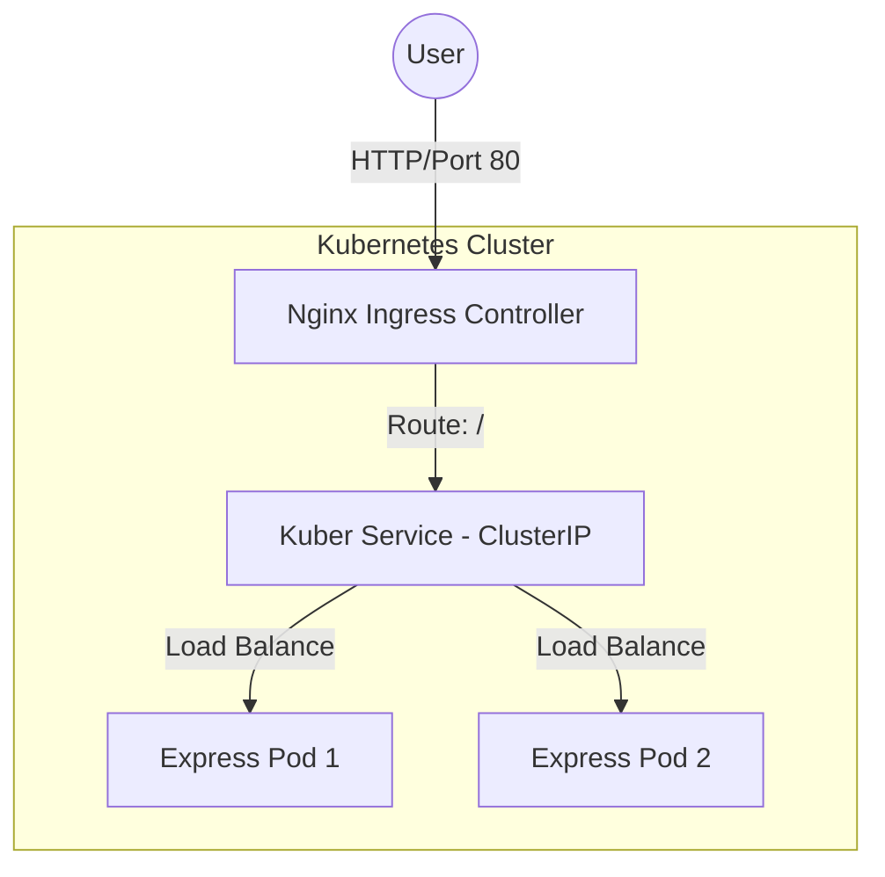

# ☸️ Kuber: A Deep Dive into Kubernetes Orchestration

Welcome to **Kuber**, a technical learning laboratory designed to explore the intricacies of Kubernetes (K8s) by deploying and managing a containerized Node.js application. This repository isn't just a project; it's a documented journey through the transition from simple Docker containers to a fully orchestrated microservice architecture.

## 🎯 Learning Goals

This project was built to master the fundamental pillars of Kubernetes:
- **Containerization Strategy**: Moving beyond local `node_modules` to optimized Docker images.
- **Orchestration Fundamentals**: Understanding the relationship between **Deployments**, **Services**, and **Ingress**.
- **Resource Management**: Learning how to define `requests` and `limits` to ensure cluster stability.
- **Scalability**: Observing how Kubernetes handles multiple replicas of a CPU-intensive workload.
- **Networking Topology**: Mapping external traffic through an Ingress controller down to individual Pods.

## 🛠 Tech Stack

| Component | Technology | Role |
| :--- | :--- | :--- |
| **Runtime** | [Node.js](https://nodejs.org/) | Lightweight backend execution |
| **Framework** | [Express.js](https://expressjs.com/) | REST API and computation engine |
| **Containerization** | [Docker](https://www.docker.com/) | Image creation and environment isolation |
| **Orchestration** | [Kubernetes](https://kubernetes.io/) | Scaling, self-healing, and service discovery |
| **Ingress** | [Nginx Ingress](https://kubernetes.github.io/ingress-nginx/) | Layer 7 load balancing |

---

## 🏗 System Architecture

The following diagram illustrates the flow of a request from the outside world into our cluster:



### 📂 Folder Structure Explained

- **[`k8s/`](file:///c:/Users/yashk/Desktop/cohort/kuber/k8s)**: The "Brain" of the operation. Contains declarative YAML manifests that define our desired state.
  - [`deployment.yml`](file:///c:/Users/yashk/Desktop/cohort/kuber/k8s/deployment.yml): Defines the number of replicas, container image, and resource constraints.
  - [`service.yml`](file:///c:/Users/yashk/Desktop/cohort/kuber/k8s/service.yml): An internal load balancer that provides a stable DNS name for the Pods.
  - [`ingress.yml`](file:///c:/Users/yashk/Desktop/cohort/kuber/k8s/ingress.yml): The gateway that exposes our service to the internet.
- **[`server/`](file:///c:/Users/yashk/Desktop/cohort/kuber/server)**: The "Worker". A Node.js application designed to simulate real-world CPU load.
  - [`server.js`](file:///c:/Users/yashk/Desktop/cohort/kuber/server/server.js): Contains a heavy computation loop (1 billion iterations) to test K8s resource management.
  - [`dockerfile`](file:///c:/Users/yashk/Desktop/cohort/kuber/server/dockerfile): Uses a multi-stage-ready `node:20-alpine` base for minimal footprint.

---

## 🧠 Core Concepts & Engineering Insights

### 1. The "Heavy Loop" Strategy
In [`server.js`](file:///c:/Users/yashk/Desktop/cohort/kuber/server/server.js), you'll find:
```javascript
app.get('/', (req, res) => {
    let sum = 0
    for (let i = 0; i < 1000000000; i++) {
        sum += i
    }
    res.status(200).send(sum);
});
```
**Why?** This isn't "bad code"—it's a intentional **synthetic load**. By making the CPU work hard, we can observe:
- How Kubernetes throttles a container when it hits its **CPU Limit**.
- How a **Horizontal Pod Autoscaler (HPA)** would react to increased metrics.
- How the **Service** distributes traffic when one Pod is busy computing.

### 2. Resource Requests vs. Limits
In [`deployment.yml`](file:///c:/Users/yashk/Desktop/cohort/kuber/k8s/deployment.yml), we defined:
```yaml
resources:
  limits:
    memory: 128Mi
    cpu: 500m
  requests:
    memory: 64Mi
    cpu: 250m
```
- **Requests**: What the container is *guaranteed*. K8s uses this to decide which Node to place the Pod on (Scheduling).
- **Limits**: The *ceiling*. If the app tries to use more than 128Mi RAM, it gets OOMKilled. If it uses more than 500m CPU, it gets throttled.
- **Insight**: Setting these correctly is the difference between a stable cluster and one where a single buggy app crashes everything (the "Noisy Neighbor" problem).

### 3. The Ingress Advantage
Instead of using `NodePort` or `LoadBalancer` for every service, we use an **Ingress**. 
- **Mental Model**: Think of Ingress as a **Smart Router**. It looks at the URL path (`/`) and decides which internal service should handle it. This saves costs and allows for SSL termination in one central place.

---

## 🛠 Setup & Deployment Guide

Follow these steps to configure your environment and deploy the application.

### 📋 Prerequisites
- **Docker Desktop**: Installed and running.
- **Resources**: Ensure Docker is allocated at least 4GB of RAM and 4 CPUs for a smooth experience.

### 🚀 Step-by-Step Installation

#### 1. Enable Kubernetes in Docker Desktop
Navigate to the **Docker Desktop GUI**, locate the **Kubernetes** tab in the sidebar settings menu, and check **Enable Kubernetes**. Click **Apply & Restart**.
- 💡 *Note*: This process downloads the Kubernetes control plane images and may take several minutes.

#### 2. Verify Cluster Connection
Confirm that your local environment is correctly talking to the cluster:
```bash
kubectl version
```
- **Validation**: You should see both `Client Version` and `Server Version` in the output.
- 🛠 *Troubleshooting*: If you see "The connection to the server was refused", ensure the Kubernetes status in the bottom-left corner of Docker Desktop is green.

#### 3. Deploy the Application
Once your [`deployment.yml`](file:///c:/Users/yashk/Desktop/cohort/kuber/k8s/deployment.yml) is ready, apply the configuration:
```bash
kubectl apply -f ./k8s/deployment.yml
```
- **Validation**: Run `kubectl get pods` to see the replicas starting up.

#### 4. Expose via Service
Apply the [`service.yml`](file:///c:/Users/yashk/Desktop/cohort/kuber/k8s/service.yml) configuration to create an internal load balancer:
```bash
kubectl apply -f ./k8s/service.yml
```
- **Validation**: Run `kubectl get svc` to verify `kuber-server-service` is active on port 80.

#### 5. Install Ingress-Nginx Controller
To handle external traffic and routing, install the official Ingress-Nginx controller:
```bash
kubectl apply -f https://raw.githubusercontent.com/kubernetes/ingress-nginx/controller-v1.12.1/deploy/static/provider/cloud/deploy.yaml
```
- 💡 *Why?*: This controller acts as the entry point (Reverse Proxy) for your cluster.

#### 6. Configure Ingress Routing
Finally, apply your [`ingress.yml`](file:///c:/Users/yashk/Desktop/cohort/kuber/k8s/ingress.yml) to map the host traffic to your service:
```bash
kubectl apply -f ./k8s/ingress.yml
```
- **Final Check**: Run `kubectl get ingress`. Once an `ADDRESS` (usually `localhost`) appears, you can access the app at `http://localhost`.

---

## 📉 Challenges & Debugging Journey

### Breakthrough: Image Pull Policy
Initially, the Pods failed with `ErrImagePull`.
- **Discovery**: When using local images in a tool like Minikube or Docker Desktop, K8s tries to pull from Docker Hub by default.
- **Solution**: Set `imagePullPolicy: Always` (or `Never` for local) and ensure the local environment is pointed to the correct Docker daemon.

### Breakthrough: TargetPort Mismatch
The Service was up, but the Ingress returned 502 Bad Gateway.
- **Discovery**: The Express app was listening on `3000`, but the Service was targeting `80`.
- **Fix**: Aligned the `targetPort` in [`service.yml`](file:///c:/Users/yashk/Desktop/cohort/kuber/k8s/service.yml) to match the container's `EXPOSE` port.

---

## 📖 Glossary for Future-Me

- **Pod**: The smallest deployable unit. One or more containers.
- **ReplicaSet**: Ensures the exact number of Pods you requested are running.
- **ClusterIP**: An internal-only IP address for a service.
- **Node**: A physical or virtual machine in the cluster.
- **Control Plane**: The "Brain" that manages the cluster state.

---

## 📅 Future Improvements
- [ ] Implement **Horizontal Pod Autoscaling (HPA)** based on CPU usage.
- [ ] Add **Liveness and Readiness Probes** to ensure zero-downtime deployments.
- [ ] Integrate a **ConfigMap** to manage the port and computation limit dynamically.
- [ ] Set up **Prometheus/Grafana** to visualize the CPU spikes in real-time.

---

*This README was generated as part of a learning journey in the Cohort program, documented for long-term retention and technical clarity.* 🚀