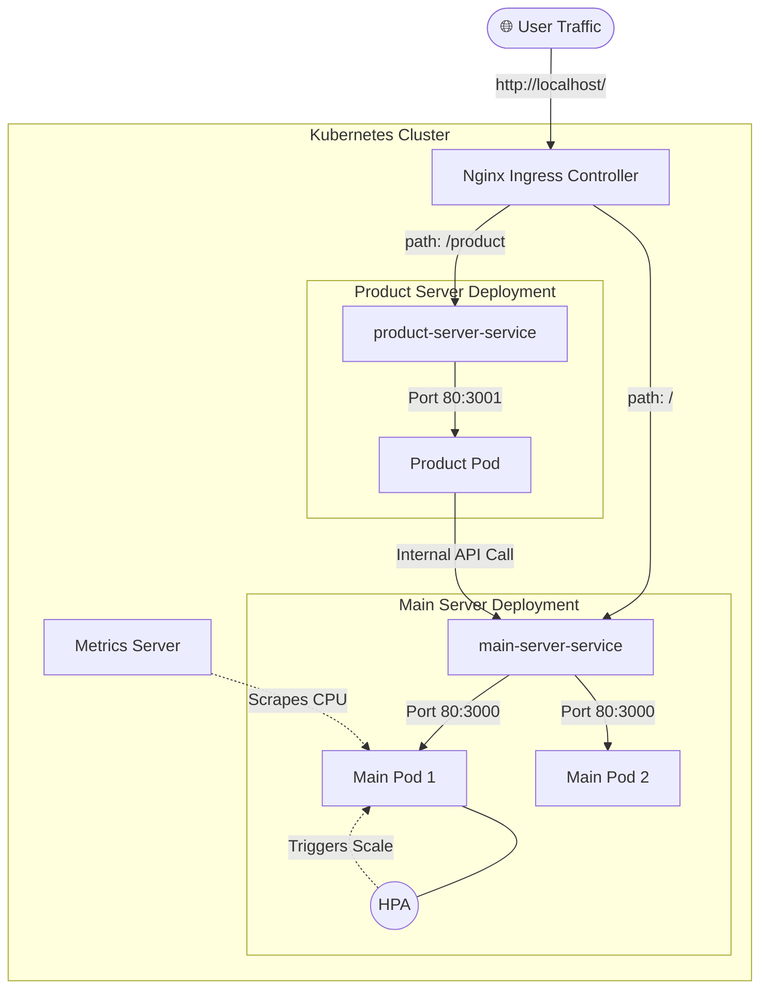

# ☸️ Kubernetes Microservices & Autoscaling Lab

## 📖 Project Overview
This project is a deep-dive engineering exploration into **Kubernetes (K8s) orchestration**, **microservices communication**, and **dynamic scaling**. It serves as a practical learning laboratory for moving from local Docker containers to a production-grade orchestration environment.

The architecture consists of two Node.js microservices (`main-server` and `product-server`) deployed on a Kubernetes cluster, managed by an Ingress controller, and protected by Horizontal Pod Autoscaling (HPA).

### 🎯 Learning Goals
- [x] Orchestrate multi-container applications using Kubernetes.
- [x] Implement internal **Service Discovery** between microservices.
- [x] Configure **Ingress Controllers** for path-based routing.
- [x] Master **Horizontal Pod Autoscaling (HPA)** based on real-time CPU metrics.
- [x] Manage resource limits and requests to ensure cluster stability.

---

## 🏗️ System Architecture

The following diagram illustrates the request flow and the internal relationship between Kubernetes components:



---

## 🛠️ Tech Stack & Concepts

| Technology | Role | Mental Model |
| :--- | :--- | :--- |
| **Node.js/Express** | Backend Services | Lightweight, event-driven API layers. |
| **Kubernetes** | Orchestrator | The "Operating System" for the data center. |
| **Docker** | Containerization | "Ship the whole computer" - packaging apps with dependencies. |
| **Ingress Nginx** | Reverse Proxy | The receptionist that directs traffic based on the URL path. |
| **Metrics Server** | Monitoring | The "Pulse Checker" for pod resource usage. |
| **HPA** | Auto-scaler | The "Elastic Band" that grows or shrinks based on stress. |

---

## 🧩 The Microservices Blueprint

### 1. Main Server (`/`)
- **Responsibility**: Performs heavy computational tasks.
- **Key Feature**: Contains an intentional CPU-intensive loop (`10^9` iterations) designed to trigger autoscaling events during load tests.
- **Path**: `kubernetes/server/main-server/`

### 2. Product Server (`/product`)
- **Responsibility**: Acts as a downstream service.
- **Communication**: Demonstrates **Inter-service Communication** by calling the `main-server` using its internal Kubernetes DNS name: `http://main-server-service/`.
- **Path**: `kubernetes/server/product/`

---

## ⚙️ Kubernetes Configuration Deep Dive

### 🏗️ Deployment: Managing the Pod Lifecycle
The Deployment ensures that a specific number of pod replicas are always running. 
- **Labels & Selectors**: The glue that connects Deployments to Pods. If a pod dies, the Deployment controller notices the missing label and spawns a new one.
- **Resource Limits**: We define `requests` (guaranteed resources) and `limits` (maximum allowed). This prevents a single "noisy neighbor" pod from crashing the entire node.

### 🛰️ Service: Stable Networking
In K8s, pods are ephemeral (they die and get new IPs). The **Service** provides a stable virtual IP and DNS name.
- **Service Discovery**: The `product` server doesn't need to know the IP of `main-server`. It just talks to `main-server-service`, and K8s handles the load balancing.

### 🚦 Ingress: The Gateway
Instead of exposing every service via a LoadBalancer (expensive), we use a single **Ingress** entry point.
- **Path-based Routing**: `path: /product` goes to the product service, while `path: /` goes to the main service.

---

## 🚀 Horizontal Pod Autoscaling (HPA)

HPA is one of the most powerful features of Kubernetes. It monitors CPU/Memory and scales the number of replicas dynamically.

### The Scaling Flow:
1. **Metrics Server** collects CPU usage from pods.
2. **HPA Controller** compares current usage against the target (e.g., 50% CPU).
3. If usage is high, it tells the **Deployment** to increase `replicas`.
4. Once load drops, it gradually scales back down to `minReplicas`.

---

## 💻 Essential Commands Reference

### Initial Setup
```powershell
# 1. Install Ingress Controller
kubectl apply -f https://raw.githubusercontent.com/kubernetes/ingress-nginx/controller-v1.12.1/deploy/static/provider/cloud/deploy.yaml

# 2. Install Metrics Server (Crucial for HPA)
kubectl apply -f https://github.com/kubernetes-sigs/metrics-server/releases/latest/download/components.yaml

# 3. Patch Metrics Server for local/insecure environments
kubectl patch deployment metrics-server -n kube-system --type=json -p='[{"op":"add","path":"/spec/template/spec/containers/0/args/-","value":"--kubelet-insecure-tls"}]'
```

### Application Deployment
```powershell
# Apply all manifests
kubectl apply -f ./k8s/deployment.yml
kubectl apply -f ./k8s/service.yml
kubectl apply -f ./k8s/ingress.yml
kubectl apply -f ./k8s/hpa.yml
```

### Monitoring & Stress Testing
```powershell
# Watch pods and CPU usage in real-time
while ($true) { kubectl top pods; Start-Sleep 2; Clear-Host }

# Generate Load (200 concurrent users for 2 minutes)
npx autocannon -c 200 -d 120 http://localhost
```

---

## 🧠 Engineering Insights & Troubleshooting

### 💡 Breakthrough: The Metrics Server Patch
**Problem**: HPA wouldn't work because the Metrics Server couldn't verify the Kubelet certificates in a local environment.
**Solution**: Applying a JSON patch to the `metrics-server` deployment to add the `--kubelet-insecure-tls` flag. This taught me that internal K8s components often need specific security configurations to talk to each other.

### 💡 Discovery: ClusterIP vs. NodePort vs. Ingress
I learned that while `NodePort` is easy for testing, `Ingress` is the "standard" way to manage traffic in production. It allows for SSL termination and complex routing rules at the edge of the cluster.

### 💡 Insight: The Power of Labels
Labels (`app: main-server`) are not just metadata; they are the "routing logic" of Kubernetes. If a label is misspelled in a Service selector, traffic simply stops flowing, even if the pods are healthy.

---

## 📝 Personal Notes & Future Improvements
- [ ] Implement **ConfigMaps** for managing environment variables.
- [ ] Add **Liveness and Readiness Probes** to handle graceful startups.
- [ ] Explore **Helm Charts** for templating these YAML files.
- [ ] Integrate a **Database** with a Persistent Volume Claim (PVC).

---
*This notebook is part of my DevOps journey. Built with ❤️ and a lot of `kubectl apply -f`.*
