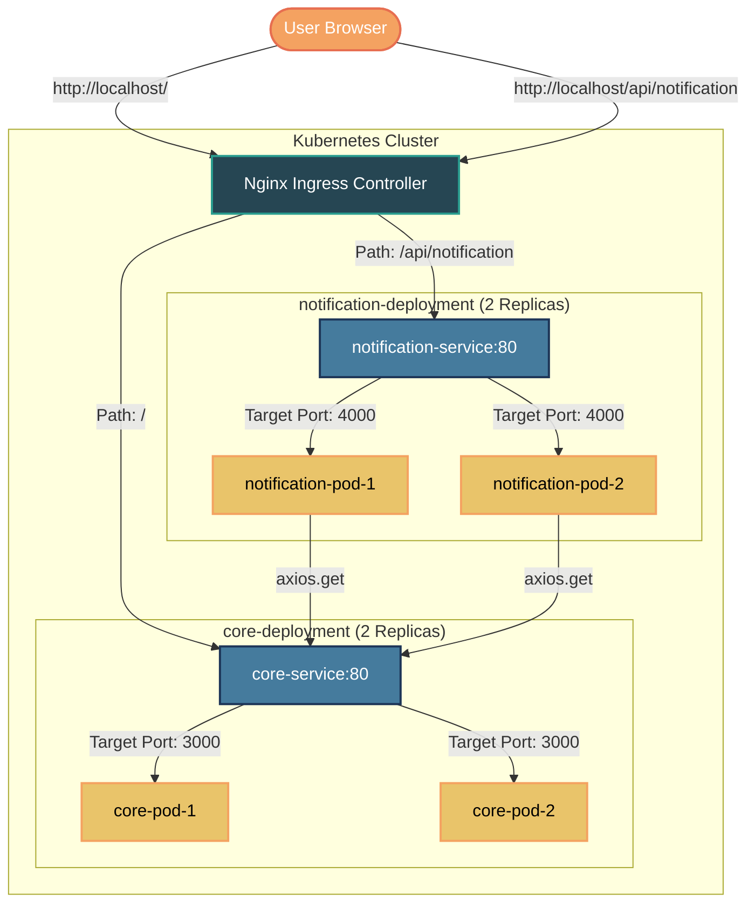
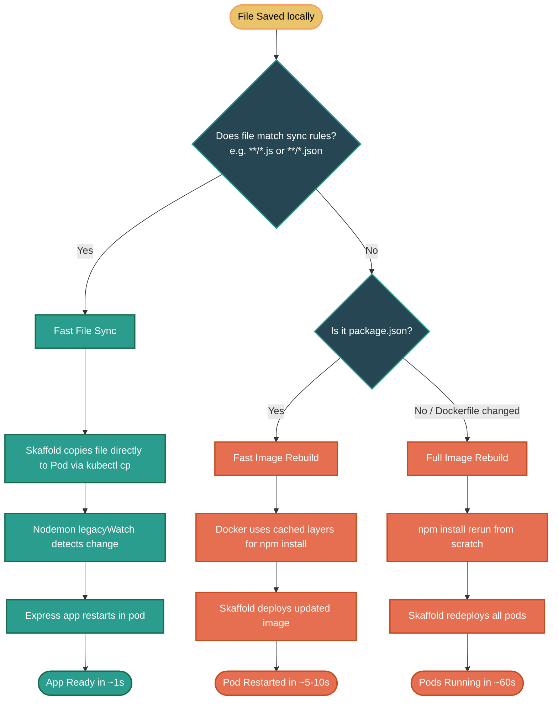

# 🚀 Skaffold + MERN Microservices: A Technical Learning Journal & Engineering Notebook

Welcome to my personal engineering journal and technical revision guide for mastering **Kubernetes-native local development**. This repository serves as a deep dive into orchestrating distributed microservices locally, highlighting the engineering decisions, trade-offs, and design patterns required to bridge the gap between containerized production architecture and a fast, productive local developer experience.

---

## 🌟 Project Overview & Why it Exists

Developing for microservices architectures that eventually run in Kubernetes clusters introduces a classic developer friction point: the **slow feedback loop**.

### The Traditional Kubernetes Development Friction
In standard web development, saving a file triggers a hot reload in a split second (`npm run dev`). However, in a Kubernetes environment, deploying a code change typically requires:
1. Re-building the container image.
2. Pushing the image to a container registry.
3. Updating the Kubernetes Deployment manifest (triggering a rolling update).
4. Waiting for old Pods to terminate and new Pods to start up.

This process can take anywhere from **60 seconds to several minutes** per code change, killing productivity.

### The Solution: Skaffold + In-Pod Hot Reload
This project implements a local Kubernetes development flow using **Skaffold**. By coordinating with **Docker Desktop's local Kubernetes cluster**, Skaffold detects file modifications and bypasses the build-and-deploy cycle. It syncs modified source files directly into the active container filesystems. Combined with `nodemon` running in **legacy polling mode** inside the pods, this gives us a sub-second "Hot Reload" loop directly inside a live Kubernetes environment.

---

## 🏗️ System Architecture

The microservices architecture is structured around two Express services (`core` and `notification`) exposed through an Ingress controller, with internal communication handled through cluster-native DNS.



### 1. Ingress Layer
The Nginx Ingress Controller acts as the API Gateway/reverse proxy exposing the cluster to the host machine. It evaluates routing rules based on path prefixes:
*   `http://localhost/` is forwarded to `core-service` on port `80`.
*   `http://localhost/api/notification` is forwarded to `notification-service` on port `80`.

### 2. Core Service
Runs an Express backend application that simulates a CPU-heavy work payload by calculating a summation from `0` to `1,000,000` on the root `/` endpoint. It listens on port `3000`.

### 3. Notification Service
Acts as a downstream client service. It exposes `/api/notification` which performs an inter-service HTTP request using `axios` to fetch data from the core service via K8s DNS (`http://core-service/`). It listens on port `4000`.

---

## 🛠️ Tech Stack & Mental Models

| Category | Technology | Purpose in Project | Mental Model / Core Concept |
| :--- | :--- | :--- | :--- |
| **Orchestrator** | **Skaffold (v4beta13)** | Automates the local dev loop (watch, build, sync, deploy, port-forward, log-tailing). | Think of Skaffold as `nodemon` for the entire Kubernetes cluster. It coordinates the local files with container states. |
| **Runtime** | **Kubernetes (K8s)** | Runs the microservices using Deployments, Services, and Ingress resources. | A declarative engine. You define the *desired* state (e.g., 2 replicas of core), and Kubernetes constantly aligns the *actual* state. |
| **Container Engine** | **Docker** | Containerizes services using optimized development Dockerfiles. | Isolated, reproducible execution environments. Uses layer caching to avoid rebuilding dependencies. |
| **Backend** | **Node.js / Express (v5.x)** | Powers both the `core` computation service and the `notification` orchestration service. | Single-threaded, asynchronous event-driven JavaScript backend running within Alpine Linux. |
| **HTTP Client** | **Axios (v1.x)** | Used in `notification` service for internal communication. | Standard promise-based HTTP client to make request calls across container interfaces. |
| **Process Manager** | **Nodemon (v3.x)** | Automatically restarts Node apps inside containers when files change. | A directory watcher. When updated source files are synced into the container, it triggers process restarts. |

---

## 📂 Folder Structure Explained

```text
skaffold/
├── mern/
│   ├── core/                    # Core Microservice Directory
│   │   ├── src/
│   │   │   └── index.js         # Express app running on port 3000
│   │   ├── .dockerignore        # Excludes local node_modules from build context
│   │   ├── .env                 # Local variables (defines PORT=3000)
│   │   ├── dockerfile.dev       # Development Dockerfile using node:20-alpine
│   │   ├── nodemon.json         # Nodemon configuration enabling legacy watch polling
│   │   └── package.json         # Package dependencies and startup scripts
│   │
│   ├── notification/            # Notification Microservice Directory
│   │   ├── src/
│   │   │   └── index.js         # Express app running on port 4000 (calls http://core-service/)
│   │   ├── .dockerignore        # Excludes node_modules from container copy
│   │   ├── .env                 # Local variables (defines PORT=3001)
│   │   ├── dockerfile.dev       # Development Dockerfile
│   │   ├── nodemon.json         # Nodemon config
│   │   └── package.json         # Dependencies (includes axios)
│   │
│   ├── k8s/                     # Kubernetes Manifests Directory
│   │   ├── core-deployment.yml  # Deployment defining 2 replicas, CPU/RAM limits, and image
│   │   ├── core-service.yml     # ClusterIP service exposing core on port 80 -> 3000
│   │   ├── notification-deployment.yml # Deployment for notification service (2 replicas)
│   │   ├── notification-service.yml    # ClusterIP service exposing notification on port 80 -> 4000
│   │   └── ingress.yml          # Ingress routing rules mapping paths to services
│   │
│   └── skaffold.yml             # Skaffold Configuration (The orchestrator brain)
│
└── skaffold-mern-notes.html     # Raw learning logs and configuration reference notes
```

---

## 🔄 The Dev Loop: Sync vs. Rebuild

A fundamental skill in Kubernetes-native development is configuring Skaffold to understand when it can perform a simple **file sync** vs. when it must trigger a **full container rebuild**.



### Sync vs. Rebuild Behavior Comparison Matrix

| Trigger Event | Action Taken | Duration | Core Mechanics |
| :--- | :--- | :--- | :--- |
| **Save modification in `src/**/*.js`** | **File Sync** | ~1 second | Skaffold intercepts the file save, compares it against the `sync.manual` array, and copies it directly into the running pods (`/app/src/...`) via a stream akin to `kubectl cp`. `nodemon` detects the write and restarts the server process. |
| **Save modification in `src/**/*.json`** | **File Sync** | ~1 second | Same as above. The file is hot-patched without disrupting pod lifecycle or network routing. |
| **Update `package.json`** (e.g. running `npm install`) | **Fast Container Rebuild** | ~5-10 seconds | Skaffold detects the metadata change. It triggers a Docker build. Docker reads `dockerfile.dev` and uses its **layer cache** for all lines prior to `COPY package*.json` and `RUN npm install`. Because dependencies changed, it re-runs `npm install`, then copies the source, and redeploys the pods. |
| **Modify `dockerfile.dev`** | **Full Container Rebuild** | ~60 seconds | The base configuration of the container filesystem was altered. Cache is invalidated at the modified line. The image is fully rebuilt and re-deployed. |

---

## 🛠️ Step-by-Step Development Journey

This is the chronological sequence followed to bring the local Kubernetes cluster to life.

### Step 1: Enable Local Kubernetes
First, Docker Desktop was configured to enable its built-in single-node Kubernetes cluster.
*   **Action**: Navigated to **Docker Desktop → Settings → Kubernetes** and checked **Enable Kubernetes**.
*   **Verification**: Verified context and node availability:
    ```powershell
    kubectl config use-context docker-desktop
    kubectl get nodes
    # Output: docker-desktop   Ready   control-plane   ...
    ```

### Step 2: Install nginx Ingress Controller
Kubernetes Ingress resources are just routing rules; they require an actual *Ingress Controller* running in the cluster to act as the traffic router and load balancer.
*   **Action**: Applied the official Nginx Ingress Controller manifest for Docker Desktop and waited for it to be ready:
    ```powershell
    kubectl apply -f https://raw.githubusercontent.com/kubernetes/ingress-nginx/controller-v1.10.0/deploy/static/provider/cloud/deploy.yaml
    
    kubectl wait --namespace ingress-nginx --for=condition=ready pod --selector=app.kubernetes.io/component=controller --timeout=90s
    ```

### Step 3: Write Optimized Dockerfiles (`dockerfile.dev`)
To keep container rebuilds fast when dependencies are updated, we split the copying of package configuration and source files.
```dockerfile
FROM node:20-alpine

WORKDIR /app

# Cached Layer: package files copy and install. 
# This layer is rebuilt ONLY when package.json or package-lock.json changes.
COPY package*.json ./
RUN npm install

# Source Layer: copies all local files (except those in .dockerignore).
COPY . .

EXPOSE 3000
CMD ["npx", "nodemon", "src/index.js"]
```

### Step 4: Configure Nodemon (`nodemon.json`)
Inside Docker containers, especially when running on Windows with WSL2 mounts, standard filesystem notifications (`inotify`) often fail to pass from the host OS to the container OS.
*   **Action**: Enabled `legacyWatch: true` inside `nodemon.json` to force nodemon to poll files at regular intervals.
    ```json
    {
      "watch": ["src"],
      "ext": "js,json",
      "ignore": ["node_modules"],
      "delay": 500,
      "legacyWatch": true
    }
    ```

### Step 5: Draft Kubernetes Manifests (`k8s/`)
Wrote declarative configurations for:
1.  **Deployments** (`core-deployment.yml`, `notification-deployment.yml`): Sets replica count to 2, specifies resource limits to prevent memory leaks from taking down the cluster, and sets local image pull policies.
2.  **Services** (`core-service.yml`, `notification-service.yml`): Exposes pods internally using a stable DNS alias (`ClusterIP`).
3.  **Ingress** (`ingress.yml`): Registers host-level routing bindings.

### Step 6: Write Skaffold Orchestration Plan (`skaffold.yml`)
The root configuration file tying the entire system together. It maps local directory contexts to Kubernetes images, defines the manual sync rules, references the manifests, and configures port forwarding for debugging.

---

## 🧠 Deep Engineering Insights & Trade-Offs

### 1. The `imagePullPolicy: IfNotPresent` Trap
In a real production environment, Kubernetes pods are expected to pull verified images from Docker Hub, AWS ECR, or GitHub Packages. However, in our local dev environment, our `core` and `notification` images only exist inside Docker's local image storage on our machine.
*   **Trade-off**: If `imagePullPolicy` is omitted or set to `Always`, Kubernetes will contact an external registry, fail to find our local images, and crash the Pods with `ImagePullBackOff`.
*   **Solution**: Set `imagePullPolicy: IfNotPresent` in both deployment manifests. This tells Kubernetes to look in the local Docker daemon first before attempting to pull from a registry.

### 2. The Ingress `rewrite-target` Paradox
Many tutorials suggest using the rewrite annotation:
`nginx.ingress.kubernetes.io/rewrite-target: /`
This strips the prefix off an incoming URL. For example, if a request hits `localhost/api/notification`, the ingress controller strips `/api/notification` and passes `/` to the service.

*   **Why we did NOT use it**: In our project, the `notification` service defines its route handler as:
    ```javascript
    app.get('/api/notification', async (req, res) => { ... })
    ```
    If we had implemented the `rewrite-target: /` annotation, the request would reach the notification pod as `/`, triggering the home route `app.get('/', ...)` instead of `/api/notification`.
    By keeping the route names consistent across Ingress and Express, we avoid the rewrite annotation entirely, making the routes predictable and matching local testing environments.

### 3. Build Context Pathing in `skaffold.yml` Sync Rules
A common mistake when setting up Skaffold sync is providing paths relative to the project root:
```yaml
# INCORRECT CONFIGURATION
- image: core
  context: core
  sync:
    manual:
      - src: 'core/**/*.js'
        dest: /app
```
*   **The Bug**: Because `context` is set to `core`, Skaffold changes its directory context to the `./core` folder before executing sync operations. Setting `src: 'core/**/*.js'` instructs Skaffold to search for `./core/core/**/*.js` which evaluates to nothing. Consequently, Skaffold fails to find any matching files, triggers a full image rebuild on every single file save, and completely defeats the hot reload setup.
*   **The Fix**: Keep the path relative to the context: `src: '**/*.js'`.

### 4. Port Configuration Asymmetry
In `notification/src/index.js`, we see:
```javascript
const PORT = process.env.PORT || 4000;
```
However, in `notification/.env` we have:
```ini
PORT=3001
```
*   **The Discovery**: When running the container, `nodemon` loads the application. In our local repository, we have a `.env` file containing `PORT=3001`. Why then does our Kubernetes service forward traffic to port `4000`?
*   **The Reason**: In `notification-deployment.yml`, we define the container port as `4000`. Since the `.env` file is excluded from the container by `.dockerignore` (to prevent local secrets from leaking into containers), the pod does not see `PORT=3001` at runtime. `process.env.PORT` resolves to `undefined`, fallback to `4000` occurs, and it binds successfully to the port expected by Kubernetes.

---

## 🚧 Challenges Faced & Breakthrough Moments

### 💥 Challenge 1: The Infinite Rebuild Loop
*   **Symptom**: Editing a simple `.js` file resulted in a full 60-second build instead of a fast sync.
*   **Investigation**: Inspected the console output with `skaffold dev --verbosity=info`. Found that Skaffold was registering updates inside `node_modules` and triggering builds.
*   **Breakthrough**: Discovered that `.dockerignore` had been missing in the service directories. Without `.dockerignore`, Skaffold watched the local `node_modules` folder. Whenever local files were modified, local cache or package metadata changes were caught by the file watcher, forcing Skaffold to rebuild the image. Adding `node_modules` to `.dockerignore` instantly solved the issue.

### 💥 Challenge 2: Ingress 404 Routing Failure
*   **Symptom**: Running `curl http://localhost/api/notification` returned a `404 Not Found` from Nginx.
*   **Investigation**: Ran `kubectl get ingress` and saw the `queue-ingress` resource was created, but checking the ingress controller pods with `kubectl get pods -n ingress-nginx` showed no running pods.
*   **Breakthrough**: Realized that writing an `Ingress` manifest only defines the *rules*. Without a controller running in the cluster to read and execute those rules, they are ignored. Running the official controller installation script immediately activated routing, and requests started reaching the Express apps.

---

## 🚀 Key Commands Reference

### Environment & Dependency Setup
```powershell
# Install Skaffold via Chocolatey (Windows)
choco install skaffold -y

# Verify Skaffold Installation
skaffold version

# Install Ingress Nginx Controller on Docker Desktop
kubectl apply -f https://raw.githubusercontent.com/kubernetes/ingress-nginx/controller-v1.10.0/deploy/static/provider/cloud/deploy.yaml
```

### Developer Workflow Commands
```powershell
# Start the local development loop
skaffold dev

# Start development loop and output all pod logs concurrently
skaffold dev --tail

# Deep inspection of Skaffold decisions (Sync vs. Rebuild logs)
skaffold dev --verbosity=info

# Build images only (useful for validating Dockerfiles and caching)
skaffold build

# Preview the final merged Kubernetes YAML manifest without deploying
skaffold render

# Clean up all deployments, services, and ingresses created by Skaffold
skaffold delete
```

### Cluster Troubleshooting Commands
```powershell
# List all running pods
kubectl get pods

# View logs of the core service deployment
kubectl logs -f deploy/core-deployment

# Shell execution inside a running pod
kubectl exec -it deploy/core-deployment -- /bin/sh

# View detailed status and events of a specific pod (useful for ImagePullBackOff errors)
kubectl describe pod <pod-name>
```

---

## 📝 Future Improvements Roadmap

*   [ ] **React Frontend Integration**: Add a client frontend microservice inside the cluster under `mern/client` and add routing rules in Ingress to forward `/` to the client.
*   [ ] **Shared Common Library**: Implement a local npm package or git submodule for shared middleware (e.g. error handlers, request validation, authentication) imported by both microservices.
*   [ ] **State Storage**: Add a MongoDB container running inside the cluster or connect to MongoDB Atlas to complete the MERN database component.
*   [ ] **Helm Migration**: Replace raw YAML manifests in `k8s/` with Helm charts to manage environment configurations (dev, staging, production) cleanly.

---

## 📖 Glossary

*   **Skaffold**: A developer tool that facilitates continuous development for Kubernetes applications.
*   **ClusterIP**: A Kubernetes Service type that exposes the service on an internal IP inside the cluster. It makes the service only reachable from within the cluster.
*   **Ingress**: An API object that manages external access to the services in a cluster, typically HTTP. Ingress can provide load balancing, SSL termination and name-based virtual hosting.
*   **Sync (Skaffold)**: The process of copying files from the host machine directly into the container filesystem of a running Pod without recreating the container.
*   **Build Context**: The set of files located in the specified path or URL that the Docker daemon accesses during image generation.
*   **Layer Caching**: A Docker mechanism where layers that have not changed are reused from cache during build operations, reducing build times.
*   **Nodemon**: A tool that helps develop Node.js-based applications by automatically restarting the node application when file changes in the directory are detected.
*   **legacyWatch**: A nodemon setting that switches file monitoring from system event interrupts (`inotify`) to filesystem polling. Required in virtualized or container environments.
